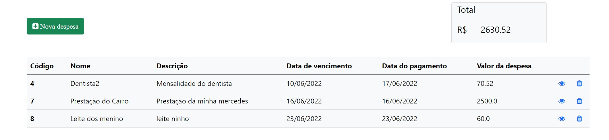
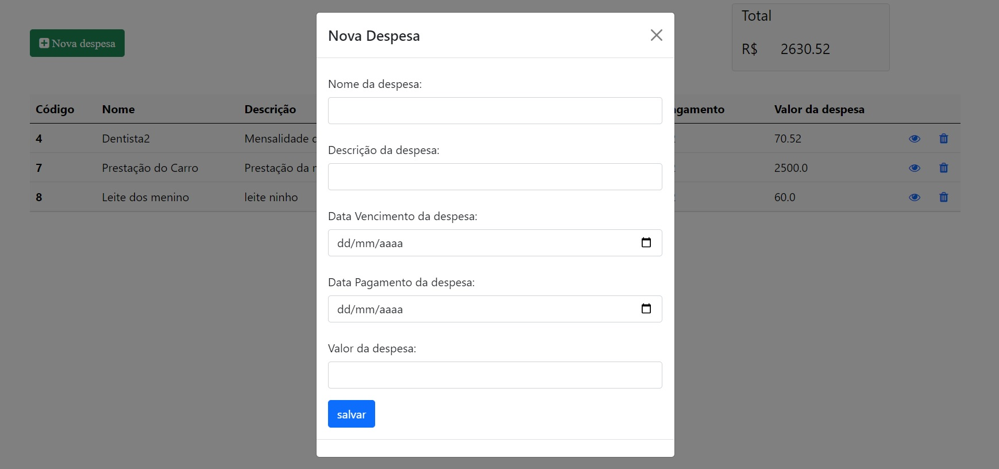
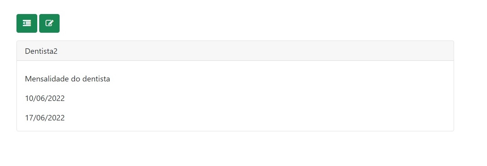
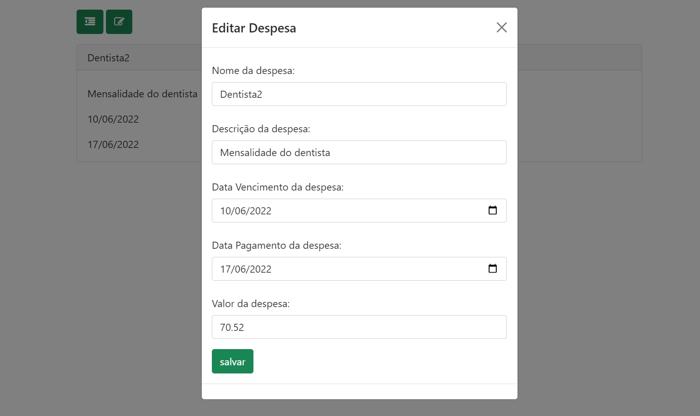

# Gerenciados-De-Despesas
CRUD gestão de despesas com Java Spring

<html lang="pt-br">
  <head>
    <!-- Required meta tags -->
    <meta charset="utf-8">
    <meta name="viewport" content="width=device-width, initial-scale=1">

   
  </head>
  <body>
    <h1>Gerenciador de Tarefas</h1>

    
    #Tabela contendo todas as despesas registradas
    #Visualização do valor total de despesas
    
   
  
  

    
   #Adicionando despesa 
    
  
 
   
  #Visualizando uma despesa da lista 
    
  
 
     
  #editando uma despesa da lista
    
  
  
    
    
  </body>
</html>
